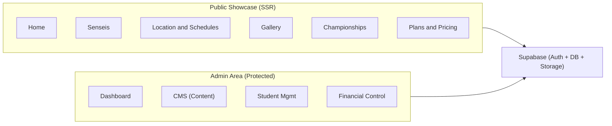

# Dojo Digital -- High-Level Build Plan

## Current State

The project is a **fresh Next.js 16 boilerplate** with Tailwind CSS v4 and TypeScript. No custom code, components, or backend exists yet. Full design prototypes (6 HTML files) and detailed specs live in `[doc/](doc/)`.

**Stack:** Next.js 16 (App Router), TypeScript, Tailwind CSS v4, Shadcn/UI, Supabase, Zustand, React Hook Form + Zod.

---

## Step 1: Project Foundation and Design System

**Goal:** Establish the project skeleton, install all dependencies, and build the shared layout (Navbar + Footer) so every subsequent page has a consistent shell.

**Work:**

- Create folder structure per spec: `src/{components, hooks, lib, services, store, types, styles}`
- Install dependencies: `@supabase/supabase-js`, `zustand`, `react-hook-form`, `zod`, `@hookform/resolvers`
- Initialize Shadcn/UI (installs Radix primitives, sets up `components/ui/`)
- Configure Tailwind theme in `globals.css` to match prototypes: brand colors (`primary: #f20d0d`, `background-light: #f8f5f5`, `background-dark: #221010`), Lexend font, border-radius tokens
- Build `Navbar` component (sticky, responsive, mobile hamburger menu, CTA button) -- reference: `[doc/prototype/home.html](doc/prototype/home.html)` lines 37-66
- Build `Footer` component (3-column layout with logo, quick links, social icons, WhatsApp) -- reference: `[doc/prototype/home.html](doc/prototype/home.html)` lines 220-270
- Integrate Navbar + Footer into root `layout.tsx`

**Quality Test:**

- `npm run build` passes with zero errors
- Dev server renders the shared layout on desktop and mobile viewports (320px, 768px, 1280px)
- Lighthouse accessibility score >= 90 on the empty shell page

---

## Step 2: Landing Page (Home)

**Goal:** Deliver the first public-facing page -- the highest-impact page for visitor conversion. Uses static/hardcoded data initially.

**Work:**

- Hero section with background image, headline, subtitle, dual CTA buttons
- "Why train with us" benefits grid (3 cards: Certified Masters, Family Environment, Self Defense)
- Testimonials section (3 testimonial cards with quotes and attribution)
- Reference: `[doc/prototype/home.html](doc/prototype/home.html)`

**Quality Test:**

- Page is a Server Component (no `"use client"` directive)
- All images use `next/image` with proper `alt` text
- Mobile-first responsive layout verified at 320px, 768px, 1280px
- Lighthouse Performance >= 85, SEO >= 90
- Dynamic `<title>` and `<meta description>` render correctly

---

## Step 3: Senseis Page (Authority)

**Goal:** Build the instructor showcase to establish credibility and authority -- a key SEO and trust signal.

**Work:**

- Route: `/senseis`
- Founder hero profile (large image, biography, philosophy quote, CTA buttons)
- Instructor grid (3 cards with photo, name, rank, specialty, "See Profile" link)
- Reference: `[doc/prototype/sensei.html](doc/prototype/sensei.html)`

**Quality Test:**

- Fully server-rendered (view-source shows complete HTML)
- Responsive across breakpoints
- Page-specific `metadata` export with title + description + Open Graph tags
- Images optimized with `next/image`

---

## Step 4: Location and Schedules Page

**Goal:** Help visitors find the dojo and check class times -- the most critical information for converting leads.

**Work:**

- Route: `/horarios`
- Location card (address, phone, email, "Get Directions" link)
- Facility badges (parking, changing rooms)
- Map placeholder (static image or embedded Google Maps iframe)
- Schedule grid: cards grouped by day (Mon/Wed/Fri and Tue/Thu), each listing time slots and instructor
- Category filter tabs (Infantil / Adultos) as a Client Component
- Reference: `[doc/prototype/location.html](doc/prototype/location.html)`

**Quality Test:**

- Category filter toggles correctly between Infantil/Adultos schedules
- Contact info is crawlable (not hidden behind JS)
- Responsive layout at all breakpoints
- Page metadata exported

---

## Step 5: Gallery Page

**Goal:** Visual social proof -- showcase the dojo's atmosphere through optimized photography.

**Work:**

- Route: `/galeria`
- Masonry image grid (CSS columns: 1 col mobile, 2 col tablet, 3 col desktop)
- Category filter pills (Todos, Sensei Luciano, Belt Ceremonies, Kids, Dojo) -- Client Component
- Lightbox overlay for full-screen image viewing (Shadcn Dialog or custom)
- Hover overlay with category label and title
- Reference: `[doc/prototype/gallery.html](doc/prototype/gallery.html)`

**Quality Test:**

- All images use `next/image` with `sizes` attribute for responsive loading
- Lazy loading confirmed (images below fold load on scroll)
- Lightbox opens/closes with keyboard (Escape) and click
- Filter correctly shows/hides images by category
- Responsive masonry layout verified

---

## Step 6: Championships Page

**Goal:** Display competitive achievements -- builds prestige and attracts competitive athletes.

**Work:**

- Route: `/campeonatos`
- Hero section with global medal counters (Gold, Silver, Bronze, Trophies)
- Hall of Fame: 4 athlete cards with photo overlay, name, and top achievement
- Timeline: chronological list of championship events with date, location, medal breakdown, and individual results
- "Load more" button (client-side pagination)
- CTA banner at the bottom
- Reference: `[doc/prototype/championships.html](doc/prototype/championships.html)`

**Quality Test:**

- Medal counters display correctly
- Timeline renders with proper visual hierarchy
- "Load more" fetches additional events
- Page metadata with structured data for events
- Responsive at all breakpoints

---

## Step 7: Plans and Pricing Page

**Goal:** Provide clear pricing info to remove friction from the conversion funnel.

**Work:**

- Route: `/planos`
- 3 pricing cards (3x/week, 2x/week "Recommended", Family) with monthly/quarterly/semi-annual/annual tiers
- Belt exam pricing table
- Single-class pricing card
- Payment methods card
- FAQ accordion (Shadcn Accordion component)
- Reference: `[doc/prototype/plans.html](doc/prototype/plans.html)`

**Quality Test:**

- "Recommended" plan visually highlighted and elevated
- FAQ accordion opens/closes correctly, accessible with keyboard
- All pricing data readable and aligned on mobile
- CTA buttons present on each plan card
- Responsive at all breakpoints

---

## Step 8: Supabase Backend and Database Schema

**Goal:** Set up the data infrastructure so the public pages can be driven by real data and the admin can manage content.

**Work:**

- Create Supabase project and configure environment variables (`.env.local`)
- Create Supabase client utilities: `lib/supabase/server.ts` (Server Component client) and `lib/supabase/client.ts` (Browser client)
- Design and create database tables:
  - `senseis` (id, name, rank, specialty, bio, photo_url, order)
  - `schedules` (id, day_group, time_start, time_end, category, sensei_id)
  - `gallery_images` (id, title, category, image_url, order)
  - `championships` (id, name, date, location, status, gold, silver, bronze)
  - `championship_results` (id, championship_id, athlete_name, placement, category)
  - `testimonials` (id, author, role, quote, order)
  - `plans` (id, name, frequency, prices_json, highlighted)
  - `students` (id, name, email, phone, belt, enrollment_date, active)
  - `leads` (id, name, phone, source, created_at)
- Configure Row Level Security: public read for showcase tables, authenticated write for admin tables
- Set up Supabase Storage bucket for gallery images and sensei photos

**Quality Test:**

- All migrations run without errors
- RLS policies verified: anonymous user can SELECT showcase data, cannot INSERT/UPDATE/DELETE
- Authenticated admin user can perform full CRUD
- Storage bucket accepts image uploads and returns public URLs
- Seed script populates tables with prototype data

---

## Step 9: Connect Public Pages to Supabase

**Goal:** Replace hardcoded data with live database queries -- the site is now truly dynamic and manageable.

**Work:**

- Create service layer: `services/senseis.ts`, `services/schedules.ts`, `services/gallery.ts`, `services/championships.ts`, `services/testimonials.ts`, `services/plans.ts`
- Update each public page to fetch data via `supabaseServer` in Server Components
- Replace placeholder image URLs with Supabase Storage URLs
- Add Skeleton loading states for client-side filtered content (schedules, gallery)
- Implement ISR or dynamic caching strategy (`revalidate`) for public pages

**Quality Test:**

- All pages render data from Supabase (verify by changing a DB record and refreshing)
- Pages remain server-rendered (view-source confirms full HTML)
- No client-side fetch waterfalls on initial load
- Skeleton screens appear while filter-dependent content loads
- Error boundaries handle failed data fetches gracefully

---

## Step 10: Authentication and Admin Shell

**Goal:** Secure the admin area and build the authenticated layout -- the foundation for all management features.

**Work:**

- Route group: `(admin)/`
- Configure Supabase Auth (email/password login)
- Build Login page at `/admin/login`
- Build Admin layout with sidebar navigation (Dashboard, Content, Students, Finance)
- Implement RBAC middleware: check for authenticated session + admin role on all `/admin/` routes
- Zustand store for logged-in user state
- Redirect unauthenticated users to login

**Quality Test:**

- Unauthenticated access to `/admin/` redirects to `/admin/login`
- Successful login redirects to `/admin/dashboard`
- Logout clears session and redirects to home
- Admin sidebar navigation works on desktop and mobile
- Invalid credentials show appropriate error message

---

## Step 11: Admin CMS (Content Management)

**Goal:** Allow the dojo admin to manage all public-facing content without touching code.

**Work:**

- **Schedules CRUD:** list view, create/edit form (React Hook Form + Zod validation), delete with confirmation
- **Senseis CRUD:** list, create/edit with image upload to Supabase Storage, reorder
- **Gallery CRUD:** image upload with category assignment, drag-to-reorder, delete
- **Championships CRUD:** event form + nested results management
- **Testimonials CRUD:** simple form with quote, author, role
- **Plans CRUD:** pricing editor with JSON structure for tiers
- Use Server Actions for all mutations
- Implement optimistic UI updates with Zustand where appropriate

**Quality Test:**

- Admin creates a new schedule entry -> it appears on the public `/horarios` page
- Admin uploads a gallery image -> it appears in the public `/galeria` page
- Admin edits a sensei bio -> change reflects on `/senseis`
- Admin deletes a championship -> it disappears from `/campeonatos`
- Form validation prevents invalid data (empty fields, wrong formats)
- Image upload shows progress and handles errors

---

## Step 12: Student Management

**Goal:** Provide the core operational tool for tracking students, belts, and attendance.

**Work:**

- Route: `/admin/alunos`
- Student list with search, filter by belt/status
- Student registration form (name, email, phone, belt, plan)
- Student detail view with belt history and attendance log
- Belt promotion workflow (update belt, record date)
- Birthday report (students with birthday this month)

**Quality Test:**

- Admin can register a new student and find them via search
- Belt promotion updates the student record and is visible in history
- Birthday filter correctly shows current month's birthdays
- Form validation catches required fields and email format
- Data persists across sessions (refresh, logout/login)

---

## Step 13: Admin Dashboard and Financial Overview

**Goal:** Give the admin an at-a-glance view of dojo health -- new leads, active students, birthdays, and payment status.

**Work:**

- Route: `/admin` (dashboard)
- KPI cards: New leads this month, Total active students, Birthdays this month
- Recent leads list with quick actions
- Payment status overview: list of students with plan status (active, overdue, expiring)
- Simple charts (optional: bar chart for monthly enrollments)

**Quality Test:**

- KPI numbers match actual database counts
- Recent leads list updates in real-time when a new lead arrives
- Financial overview correctly identifies overdue payments
- Dashboard loads within 2 seconds
- Responsive layout for tablet use (admin on-the-go)

---

## Step 14: SEO, Performance, and Production Polish

**Goal:** Final pass to maximize search engine visibility, runtime performance, and production readiness.

**Work:**

- Dynamic metadata (`generateMetadata`) on every public page with title, description, Open Graph, Twitter cards
- Generate `sitemap.xml` and `robots.txt` via Next.js metadata API
- Audit and enforce semantic HTML5 (proper heading hierarchy, `<nav>`, `<main>`, `<article>`, `<section>`)
- Add structured data (JSON-LD) for LocalBusiness, Event, and Organization schemas
- Floating WhatsApp button (fixed position, mobile-prominent)
- Implement `loading.tsx` Skeleton screens for all public routes
- Dynamic imports for heavy admin components
- Image optimization audit: all images through `next/image`, proper `sizes`, WebP format
- LGPD/GDPR cookie consent banner (if applicable)
- Error pages: custom `not-found.tsx` and `error.tsx`

**Quality Test:**

- Lighthouse scores: Performance >= 90, SEO >= 95, Accessibility >= 90, Best Practices >= 90
- Google Rich Results Test passes for structured data
- `sitemap.xml` lists all public routes
- WhatsApp button is visible and functional on mobile
- `next build` produces zero warnings
- Full end-to-end flow: Anonymous user visits Home -> navigates to Schedules -> clicks WhatsApp CTA (conversion path works)
- Admin flow: Login -> Update schedule -> Verify on public page -> Logout
