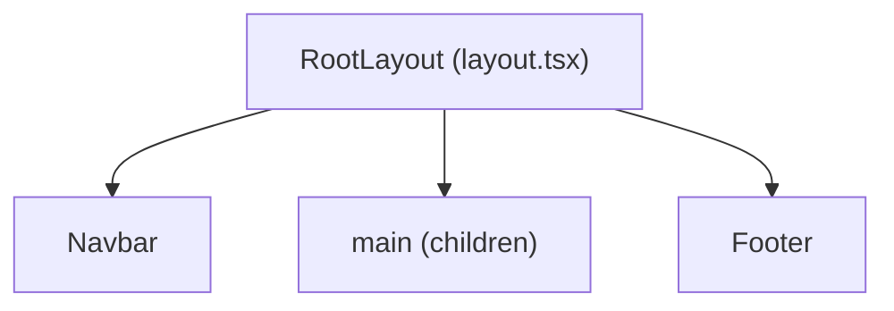

# Step 1: Project Foundation and Design System

## Current State

The project is a **stock Next.js 16 boilerplate** (React 19, Tailwind CSS v4, TypeScript). Only three files exist under `src/`:

- `[src/app/globals.css](src/app/globals.css)` -- default Tailwind import with Geist font vars
- `[src/app/layout.tsx](src/app/layout.tsx)` -- root layout using Geist fonts
- `[src/app/page.tsx](src/app/page.tsx)` -- default Next.js starter page

No components, no Shadcn, no extra dependencies. Tailwind v4 is configured via `@tailwindcss/postcss` in `[postcss.config.mjs](postcss.config.mjs)`.

---

## 1. Create Folder Structure

Create the following empty directories under `src/` as specified in `[doc/tech_stack.md](doc/tech_stack.md)`:

```
src/
├── components/        # Shared UI components (Navbar, Footer, etc.)
│   └── ui/            # Reserved for Shadcn/UI primitives
├── hooks/             # Reusable custom hooks
├── lib/               # Utilities and config (Supabase clients later)
├── services/          # Data access layer
├── store/             # Zustand stores
├── types/             # Shared TypeScript interfaces
└── styles/            # Additional CSS if needed
```

Add a `.gitkeep` in each empty directory so they are tracked in git.

---

## 2. Install Dependencies

```bash
npm install @supabase/supabase-js zustand react-hook-form zod @hookform/resolvers lucide-react
```

- `lucide-react` is the icon library used by Shadcn/UI and will replace Material Symbols from the prototypes.

---

## 3. Initialize Shadcn/UI

```bash
npx shadcn@latest init
```

Configuration choices:

- Style: **New York**
- Base color: **Neutral** (we override with brand palette)
- CSS variables: **Yes**
- `components.json` path prefix: `@/components`

This creates `components.json` at the project root and sets up the `src/components/ui/` directory. It may also install `tailwind-merge`, `clsx`, `class-variance-authority`, and Radix primitives.

After init, install the **Sheet** component (used for the mobile menu):

```bash
npx shadcn@latest add sheet button
```

---

## 4. Configure Tailwind Theme and Global Styles

Rewrite `[src/app/globals.css](src/app/globals.css)` to define the brand design system using Tailwind v4's `@theme` directive. Key tokens extracted from `[doc/prototype/home.html](doc/prototype/home.html)`:

- **Primary:** `#f20d0d` (red)
- **Background light:** `#f8f5f5`
- **Background dark:** `#221010`
- **Dark surface:** `#1a0b0b`
- **Font family:** Lexend (weights 300, 400, 500, 700, 900)
- **Border radius:** default `0.25rem`, lg `0.5rem`, xl `0.75rem`, full `9999px`
- **Max content width:** `1280px`

The file will:

1. Import Tailwind with `@import "tailwindcss"`
2. Define CSS custom properties under `:root` and `.dark` for Shadcn compatibility
3. Use `@theme inline` to register brand colors, font family, and radius tokens
4. Remove the Geist font references (replaced by Lexend)

---

## 5. Update Root Layout

Rewrite `[src/app/layout.tsx](src/app/layout.tsx)`:

- Replace Geist fonts with **Lexend** from `next/font/google` (subsets: `["latin"]`, weights: `["300","400","500","700","900"]`)
- Set `lang="pt-BR"` on `<html>`
- Update `metadata` export: title = "Dojo Luciano dos Santos Karate", description = brand tagline
- Import and render `<Navbar />` before `{children}` and `<Footer />` after
- Wrap content in `<main className="flex-grow">`
- Apply base body classes: `bg-background-light font-display antialiased`



---

## 6. Build Navbar Component

**File:** `src/components/navbar.tsx`

Reference: `[doc/prototype/home.html](doc/prototype/home.html)` lines 37-66.

### Structure

- Sticky `<nav>` with `backdrop-blur-md`, border-bottom, `z-50`
- Inner `max-w-[1280px]` container, `h-16`, flex row
- **Left:** Logo icon (lucide-react `Swords` or custom SVG) + "Dojo Luciano dos Santos" text
- **Center/Right (desktop, `hidden md:flex`):** Navigation links + CTA button
- **Right (mobile, `md:hidden`):** Hamburger button that opens a Shadcn **Sheet** (slide-in drawer)

### Navigation Links

| Label       | Href           |
| ----------- | -------------- |
| Inicio      | `/`            |
| Senseis     | `/senseis`     |
| Horarios    | `/horarios`    |
| Galeria     | `/galeria`     |
| Campeonatos | `/campeonatos` |
| Planos      | `/planos`      |

### CTA Button

- Text: "Agende Aula Gratis"
- Style: `bg-primary hover:bg-red-700 text-white font-bold rounded-lg shadow-lg`
- Links to WhatsApp (placeholder `#` for now)

### Mobile Menu (Sheet)

- Uses Shadcn `Sheet` component (side="right")
- Trigger: hamburger `Menu` icon from lucide-react
- Content: vertical list of same nav links + CTA button
- Close on link click

### Client Component

The Navbar must be `"use client"` because it uses Sheet (interactive state). Keep the component lean -- only the mobile toggle requires client-side JS.

---

## 7. Build Footer Component

**File:** `src/components/footer.tsx`

Reference: `[doc/prototype/home.html](doc/prototype/home.html)` lines 220-270.

### Structure (Server Component -- no interactivity needed)

- `<footer>` with `border-t`, white bg
- Inner `max-w-[1280px]` container, `py-12`
- **3-column grid** (`grid-cols-1 md:grid-cols-3`):
  - **Column 1:** Logo + dojo name + short description paragraph
  - **Column 2:** "Links Rapidos" heading + list of links (Inicio, Senseis, Horarios, Planos)
  - **Column 3:** "Fale Conosco" heading + social icons (Instagram, WhatsApp) + CTA button "Agende sua aula"
- **Bottom bar:** copyright text + Privacy/Terms links, separated by `border-t`

### Social Icons

- Use inline SVGs for Instagram and WhatsApp (same as prototype) or lucide-react equivalents
- Hover effects: Instagram -> primary color, WhatsApp -> green-600

---

## 8. Update Home Page (Minimal)

Replace `[src/app/page.tsx](src/app/page.tsx)` with a minimal placeholder that confirms the shell renders correctly:

- Remove all default Next.js boilerplate content
- Render a simple centered heading: "Dojo Luciano dos Santos" with a subtitle "Em breve" (coming soon)
- This page will be fully built in Step 2

---

## 9. Configure `next.config.ts`

Update `[next.config.ts](next.config.ts)` to allow external image domains used in prototypes (Google hosted images for development):

```typescript
images: {
  remotePatterns: [
    { protocol: 'https', hostname: 'lh3.googleusercontent.com' },
  ],
}
```

---

## 10. Test Phase

### 10.1 Build Verification

- Run `npm run build` -- must complete with **zero errors**
- Run `npm run lint` -- must pass with no critical issues

### 10.2 Visual Verification (Dev Server)

- Run `npm run dev` and verify in browser:
  - **Desktop (1280px):** Navbar shows all links horizontally + CTA button. Footer renders 3 columns.
  - **Tablet (768px):** Navbar collapses to hamburger. Footer stacks to fewer columns.
  - **Mobile (320px):** Hamburger menu opens Sheet drawer with all nav links. Footer is single-column.
  - Brand colors are applied: red primary, light warm background
  - Lexend font is loaded and rendering
  - Sticky navbar follows scroll

### 10.3 Accessibility Check

- All nav links and buttons are keyboard-focusable (Tab key)
- Sheet mobile menu can be opened/closed with keyboard
- All interactive elements have visible focus indicators
- Footer social icons have `aria-label` attributes
- HTML uses semantic elements: `<nav>`, `<main>`, `<footer>`
- Target: Lighthouse accessibility score >= 90

### 10.4 Code Quality

- No TypeScript errors (`npx tsc --noEmit`)
- No `any` types used
- Components follow naming conventions from `[doc/tech_stack.md](doc/tech_stack.md)`: PascalCase for components, kebab-case for folders
